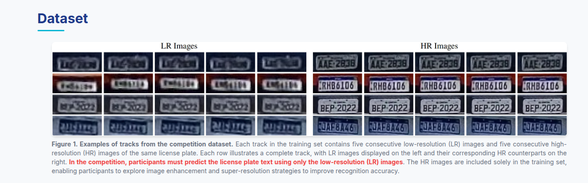
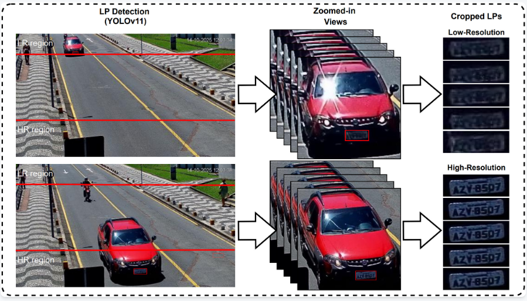
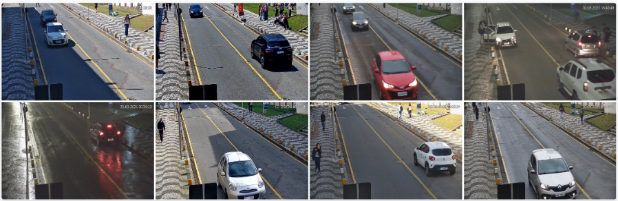

# MultiFrame-LPR

Solution for the **ICPR 2026 Competition on Low-Resolution License Plate Recognition**.

This competition focuses on license plate recognition under real-world surveillance conditions where images are low-resolution, heavily compressed, noisy, and affected by motion or character overlap. These conditions make OCR significantly more difficult.

---

## 1) Competition Challenge

In surveillance systems, license plates are often blurry, tiny, or heavily compressed due to storage and bandwidth constraints. As a result, characters can:

- be distorted,
- blend into the background,
- or overlap with neighboring symbols,

which makes automated OCR very challenging.

The goal of the competition is to develop more robust methods for LR data, including:

- super-resolution,
- temporal modeling,
- robust OCR under degraded conditions.

---

## 2) Dataset

### Training Data (LR + HR)

- Each track contains **5 LR images** and **5 HR images**.
- The training set is split into two scenarios:

**Scenario A (10,000 tracks)**
- Derived from a recently published dataset (Nascimento et al., 2025).
- Collected under relatively controlled conditions (e.g., no rain, daylight only).
- Includes annotations: `plate text`, `layout`, `corner positions`.

**Scenario B (10,000 tracks)**
- Newly collected for this competition, using the same camera but in a different orientation.
- Captured under more diverse environmental conditions.
- Includes annotations: `plate text`, `layout` (no `corner positions`).

### Test Data (LR only)

- Each track contains **5 LR images**.
- HR images are available **only in training**, allowing participants to explore enhancement/super-resolution approaches.

**Public Test (1,000 tracks)**
- Sampled from Scenario B.
- Used for public leaderboard ranking.
- This set is a subset of the blind test set.

**Blind/Private Test (3,000+ tracks)**
- Sampled from Scenario B.
- Used for final competition ranking.

### Submission Format

Submit a `.txt` file where each line follows:

```text
track_00001,ABC1234;0.9876
track_00002,DEF5678;0.6789
track_00003,GHI9012;0.4521
```

Each line is: `track_id,plate_text;confidence`.

---

## 3) Dataset Figures

### Figure 1. Training data examples (LR + HR)



### Figure 2. Dataset Creation Pipeline

License plates were first detected with **YOLOv11**, then tracked with **BoT-SORT**. LR patches correspond to vehicles farther from the camera, while HR patches were captured when vehicles were closer. Plate text labels were assigned semi-automatically using a state-of-the-art recognizer on HR patches.



### Figure 3. Scenario B Capture Conditions

Examples of diverse capture conditions in Scenario B (vehicle types, environments, and contexts).



---

## 4) Evaluation Criteria

### Primary metric: Recognition Rate (Exact Match)

$$
\text{Recognition Rate} = \frac{\#\text{Correct Tracks}}{\#\text{Total Tracks}}
$$

A track is counted as correct only when **all predicted characters** exactly match the ground truth.

### Tie-breaker: Confidence Gap

$$
\text{Confidence Gap} = \text{MeanConf(correct)} - \text{MeanConf(incorrect)}
$$

If teams tie on Recognition Rate, the team with a larger Confidence Gap ranks higher.

---

## 5) What You Have Done in This Repo

Based on experiment logs in `logs.md` and runs under `results/`, you tested multiple backbones and settings (ConvNeXt, TIMM ConvNeXtV2, EfficientNetV2, image width, dropout, learning rate, etc.).

### Quick Run (already used)

```bash
python train.py -m restran --backbone convnext --aug-level full --img-width 160 --train-lr-sim-p 0.35 --frame-dropout 0.20 --run-tag lrSim035_fd02_w160 --batch-size 64
```

Quick run results:
- Val: **78.88%**
- Public test: **75.5%**

### Current Best Model (recommended)

Tag: `E6_w192_lrSim035_fd020`

```bash
python train.py -m restran --backbone convnext --aug-level full --epochs 30 --img-width 192 --train-lr-sim-p 0.35 --frame-dropout 0.20 --run-tag E6_w192_lrSim035_fd020 --batch-size 32
```

Current best results:
- Val: **79.48%**
- Public test: **77%**
- Private test: **78%**

Representative checkpoints:
- `results/restran_E6_w192_lrSim035_fd020/restran_best.pth`
- `results/restran_E6_w192_lrSim035_fd020/checkpoints/best.pt`

---

## 6) Best Commands (Quick Guide)

### 6.1 Train the Best Config

```bash
python train.py -m restran --backbone convnext --aug-level full --epochs 30 --img-width 192 --train-lr-sim-p 0.35 --frame-dropout 0.20 --run-tag E6_w192_lrSim035_fd020 --batch-size 32
```

### 6.2 Infer on Public Test from Run Directory

```bash
python infer_public_test_run.py --run-dir results/restran_E6_w192_lrSim035_fd020 --data-root data/public_test
```

Default output: `results/restran_E6_w192_lrSim035_fd020/prediction.txt`

### 6.3 Infer from a Specific Checkpoint

```bash
python infer_public_test_run.py --checkpoint results/restran_E6_w192_lrSim035_fd020/restran_best.pth --data-root data/public_test --out results/restran_E6_w192_lrSim035_fd020/submission_restran.txt
```

---

## 7) Main Repository Structure

- `train.py`: model training.
- `infer_public_test_run.py`: public-test inference and competition-format prediction export.
- `run_ablation.py`: backbone ablation runner.
- `configs/config.py`: default configuration.
- `src/`: dataset, model, trainer, utilities.
- `logs.md`: experiment logs and benchmarks.
- `results/`: checkpoints, predictions, and per-run summaries.

---

## 8) Notes

- The default model is `restran` with temporal multi-frame OCR.
- Predictions from 5 LR frames can be aggregated using methods such as majority voting, confidence-based selection, or temporal modeling before submission.
